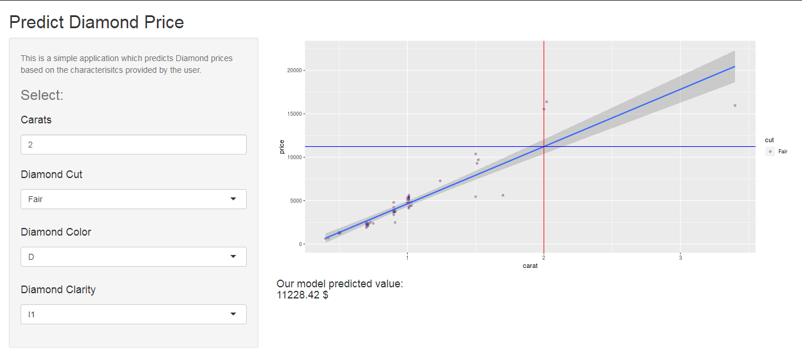

## Overview

1. This application predicts the Diamond price based on the characteristics provided by the user and interfaced as a Shiny web application.

2. The application takes the following input:

* Carat
* Cut
* Color
* Clarity 

--- .class #id 

## Process

* The application fits a multivariate linear model based on the Input provided by the user and predicts a diamond price using the 'diamonds' dataset.

--- .class #id 

## ui.R

--- .class #id 

## server.R

--- .class #id

## Source(s)

The Application live demo can be found [here](https://smug.shinyapps.io/DiamondPrice) at Shinyapps.io

[Github repository](https://github.com/SufyanRM/course-project-developing-data-products)

Thank you.

Dated: 13/January/2019
